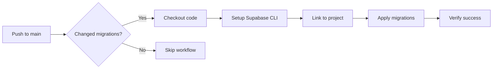

# CI/CD for Supabase Migrations

This project uses GitHub Actions to automatically apply Supabase migrations when changes are pushed to the `main` branch.

## Setup

### 1. Generate Supabase Access Token

1. Go to [Supabase Dashboard Settings](https://supabase.com/dashboard/account/tokens)
2. Click "Generate new token"
3. Give it a name like "GitHub Actions - YourProject"
4. Copy the token value

### 2. Add GitHub Secrets

In your GitHub repository:

1. Go to **Settings** → **Secrets and variables** → **Actions**
2. Add these repository secrets:

| Secret Name | Value | Description |
|-------------|--------|-------------|
| `SUPABASE_ACCESS_TOKEN` | Your access token from step 1 | Used by CLI for authentication |
| `SUPABASE_PROJECT_REF` | `gnkuikentdtnatazeriu` | Your Supabase project reference ID |

### 3. Workflow Triggers

The workflow runs automatically when:
- **Push to `main`** with changes to `supabase/migrations/**`
- **Manual trigger** via GitHub Actions UI

## Migration Workflow



## Manual Trigger

To manually run migrations:

1. Go to **Actions** tab in GitHub
2. Select "Apply Supabase Migrations" workflow
3. Click "Run workflow"
4. Choose branch (usually `main`)
5. Click green "Run workflow" button

## Migration Best Practices

### Safe Migration Structure

```sql
-- ✅ Good: Idempotent operations
DROP POLICY IF EXISTS policy_name ON table_name;
CREATE POLICY policy_name ON table_name...;

-- ✅ Good: Conditional creation
CREATE TABLE IF NOT EXISTS new_table (...);

-- ❌ Avoid: Non-idempotent operations
CREATE TABLE new_table (...);  -- Will fail if table exists
```

### Testing Migrations Locally

Before pushing:

```bash
# Start local Supabase
supabase start

# Apply migrations locally
supabase db reset

# Test your changes
# Run tests, check schemas, etc.

# When ready, commit and push
git add supabase/migrations/
git commit -m "feat: add new user roles table"
git push origin main
```

## Monitoring

### Check Workflow Status

1. **GitHub Actions tab**: See real-time workflow progress
2. **Workflow logs**: Click on runs to see detailed output
3. **Supabase Dashboard**: Verify changes were applied

### Common Issues

| Issue | Cause | Solution |
|-------|--------|----------|
| Authentication failed | Wrong token or project ref | Check GitHub secrets |
| Migration failed | SQL syntax error | Test locally first |
| CLI version issues | Outdated CLI | Workflow uses `latest` version |

### Emergency Rollback

If a migration causes issues:

1. **Revert the commit**:
   ```bash
   git revert <commit-hash>
   git push origin main
   ```

2. **Manual intervention**:
   - Use Admin Gateway to fix data
   - Apply corrective SQL via Supabase Dashboard
   - Create new migration to fix forward

## File Structure

```
.github/
└── workflows/
    └── apply-migrations.yml    # Auto-applies on main branch

supabase/
├── migrations/                 # SQL migration files
│   ├── 001_initial_schema.sql
│   ├── 002_add_profiles.sql
│   └── 003_fix_policies.sql
└── config.toml                # Project configuration
```

## Security Notes

- **No secrets in code**: All sensitive values use GitHub secrets
- **Limited scope**: Workflow only applies migrations, no arbitrary access
- **Audit trail**: All changes logged in Supabase Dashboard
- **Protected branch**: Consider requiring PR reviews for `main`